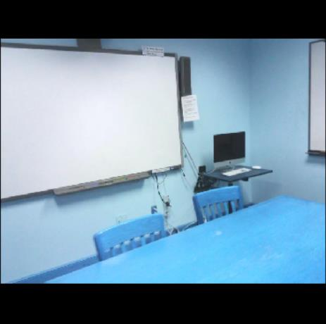
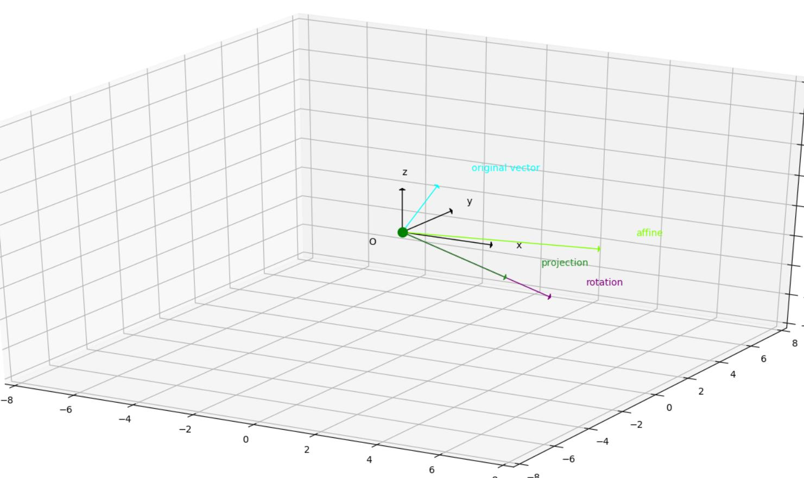
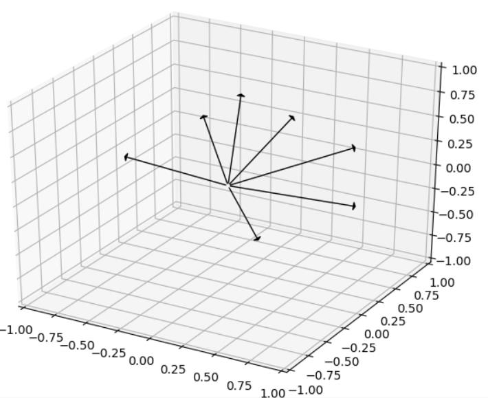
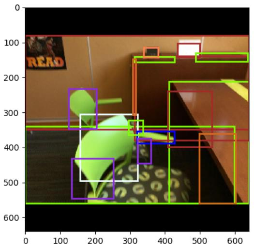

# PlaneRCNN Variables

---

## X (Input)

blue variables: parameters required for `model.predict()`

###1. images

- ####attributes 

shape = (1, 3, 640, 640)

pixel\_range = [0, 255] - config.MEAN\_PIXEL

- ####original image size: 

968 (height) * 1296 (width)

- ####operations:
 
#####1. datasets/scannet\_scene.py-`class ScanNetScene()-def __getitem__()`:

	image = cv2.imread(imagePath) 
shape = (968, 1296, 3)

pixel\_range = [0, 255]

channel = (b, g, r)

	image = cv2.resize(image, (depth.shape[1], depth.shape[0]))
shape = (480, 640, 3)

#####2. datasets/plane\_stereo\_dataset.py-`class PlaneDataset(PlaneDatasetSingle)-def __getitem__()`:

	image_1, planes_1, plane_info_1, segmentation_1, depth_1, camera_1, extrinsics_1, semantics_1 = scene[imageIndex]

shape = (480, 640, 3)

	info_1 = [image_1, planes_1, plane_info_1, segmentation_1, depth_1, camera_1, extrinsics_1, semantics_1]

	image, planes, plane_info, segmentation, depth, camera, extrinsics, semantics = info

	image = cv2.resize(image, (depth.shape[1], depth.shape[0])) 

shape = (480, 640, 3)

	image, image_metas, gt_class_ids, gt_boxes, gt_masks, gt_parameters = load_image_gt(self.config, index, image, depth, mask, class_ids, parameters, augment=self.split == 'train')

shape = (640, 640, 3)

Top 80 and bottom 80 lines of pixels are 0 padded.

padded image (bgr)

	image = utils.mold_image(image.astype(np.float32), self.config)

shape = (640, 640, 3) 

pixel\_range = [0, 255] - config.MEAN\_PIXEL

	image = torch.from_numpy(image.transpose(2, 0, 1)).float()

shape = (3, 640, 640) 

###2. image_metas

- ####attributes

shape = (1, 16)

*looks like [226078    480    640      3     80      0    560    640      1      1 1 1 1 1 1 1]*
 

image\_metas[0]: image\_id 

*image\_id = 10000 \* scene\_id + image\_num, e.g. 226078 indicates scene\_id = 22, image\_num = 6078. Scene_id has the same order as the corresponding scannetv1[.txt file](https://github.com/ScanNet/ScanNet/tree/master/Tasks/Benchmark "ScanNet/Tasks/Benchmark/") (index starts from 0). E.g., scene_id = 22 for a training image means the image is from the scene in the 23rd line of scannetv1\_train.txt*
 

image\_metas[1:4]: [height, width, channels] befor `resize_image()`

image\_metas[4:8]: (y1, x1, y2, x2) in pixels. The area of the image where the real image is (excluding the padding)

*[80      0    560    640] indicates the left top point of the real image excluding padding is `image[80, 0]`, and the right bottom point `image[560, 640]`*
 

len(image\_metas[8:]): #classes = 8

- ####operations:

#####1. datasets/plane\_stereo\_dataset.py-`class PlaneDataset(PlaneDatasetSingle)-def __getitem__()`:

	image, image_metas, gt_class_ids, gt_boxes, gt_masks, gt_parameters = load_image_gt(self.config, index, image, depth, mask, class_ids, parameters, augment=self.split == 'train')
            
As has been explained in *attributes*.

	image_metas = torch.from_numpy(image_metas)

###3. rpn\_match

- ####attributes

shape = (1, 1023001, 1)

range = {-1, 0, 1}

- ####operations:

#####1. datasets/plane\_stereo\_dataset.py-`class PlaneDataset(PlaneDatasetSingle)-def __getitem__()`:

TODO: edit after 5. - 6. 

	rpn_match, rpn_bbox = build_rpn_targets(image.shape, self.anchors, gt_class_ids, gt_boxes, self.config)

	rpn_match = rpn_match[:, np.newaxis]

	rpn_match = torch.from_numpy(rpn_match)

###4. rpn\_bbox

###5. gt\_class\_ids

- ####attributes

shape = (1, #planes)

range = [1, 7]

acquired by KNN (as described in *3.1-plane normal estimation* in the paper)

*looks like [2 3 3 2 5 2 1 1 4 6 1 2 3 3 3 4 7]*
 

- ####operations:

#####1. datasets/scannet\_scene.py-`class ScanNetScene()-def __getitem__()`:

	self.planes = np.load(scenePath + '/annotation/planes.npy')

shape = (xxx, 3), *e.g.* (338, 3)

normal vectors of planes

	newPlanes.append(self.planes[oriIndex])

	planes = np.array(newPlanes)

shape = (xxx, 3)

select appropriate ones from `planes` according to `segmentation`

	extrinsics_inv = np.array(extrinsics_inv).reshape((4, 4))
    
`extrinsics_inv` is the 4 * 4 camera extrinsic matrix read from `scenexxxx_xx/pose/xx.txt`, it looks like

`-0.955421 0.119616 -0.269932 2.655830`
`0.295248 0.388339 -0.872939 2.981598`
`0.000408 -0.913720 -0.406343 1.368648`
`0.000000 0.000000 0.000000 1.000000`

To learn more about camera matrix, please refer to [this article](https://blog.csdn.net/zb1165048017/article/details/71104241 "camera matrix") (Chinese). Here is a brief introduction to the extrinsic matrix. 

The top left 3 * 3 square matrix is a normalized orthogonal matrix and it represents a rotation matrix.

`-0.955421 0.119616 -0.269932`
`0.295248 0.388339 -0.872939`
`0.000408 -0.913720 -0.406343`

The top right 3 * 1 vector represents translation parameters.

`2.655830`
`2.981598`
`1.368648`

	extrinsics = np.linalg.inv(extrinsics_inv)	

	planes = self.transformPlanes(extrinsics, planes)

Convert the vectors in the real-world coordinate into the camera coordinate.

transformation process

*Projection*, the output vector, is the projection of *affine* on *rotation*. *Affine* is the result of the affine transformation (rotation + translation); *rotation* is the result of the rotation transformation.  

#####2. datasets/plane\_stereo\_dataset.py-`class PlaneDataset(PlaneDatasetSingle)-def __getitem__()`:
	plane_offsets = np.linalg.norm(planes, axis=-1)   
                

    plane_normals = planes / np.expand_dims(plane_offsets, axis=-1)

normalization

    distances_N = np.linalg.norm(np.expand_dims(plane_normals, 1) - self.config.ANCHOR_NORMALS, axis=-1)

self.config.ANCHOR_NORMALS.shape = (7, 3)

distance_N.shape = (#planes, 7)

anchor normals

	
	normal_anchors = distances_N.argmin(-1)

	class_ids.append(normal_anchors[planeIndex] + 1)

the nearest anchor

	class_ids = np.array(class_ids, dtype=np.int32)

###6. gt\_boxes

- ####attributes

shape = (1, #planes, 4)

ground truth boxes

#####1. datasets/scannet\_scene.py-`class ScanNetScene()-def __getitem__()`:

	segmentation = cv2.imread(segmentationPath, -1).astype(np.int32)

shape = (480, 640, 3)

	segmentation = (segmentation[:, :, 2] * 256 * 256 + segmentation[:, :, 1] * 256 + segmentation[:, :, 0]) // 100 - 1

	newSegmentation = np.full(segmentation.shape, fill_value=-1, dtype=np.int32)

	newSegmentation[segmentation == oriIndex] = newIndex

	segmentation = newSegmentation

`oriIndex` excludes plane instances that are small and close to the origin of camera coordinates. 

non-planar pixels are denoted as -1

	segmentation, plane_depths = cleanSegmentation(image, planes, plane_info, segmentation, depth, self.camera, planeAreaThreshold=self.options.planeAreaThreshold, planeWidthThreshold=self.options.planeWidthThreshold, confident_labels=self.confident_labels, return_plane_depths=True)

#####2. datasets/plane\_stereo\_dataset.py-`class PlaneDataset(PlaneDatasetSingle)-def __getitem__()`:

	m = segmentation == planeIndex

shape = (480, 640, num_instances)

range = {0 (False), 1 (True)}

	instance_masks.append(m)

	mask = np.stack(instance_masks, axis=2)

shape = (480, 640, #planes)

	image, image_metas, gt_class_ids, gt_boxes, gt_masks, gt_parameters = load_image_gt(self.config, index, image, depth, mask, class_ids, parameters, augment=self.split == 'train')

draw the bounding box according to a segmentation

###7. gt\_masks
###8. gt\_parameters
###9. gt_depth
###10.	extrinsics
###11.	gt\_plane
###12.	gt\_segmentation
###13.	plane\_indices
###14.	camera

## Y (Output)
###1. rpn\_class\_logits
###2. rpn\_pred\_bbox
###3. target\_class\_ids
###4. mrcnn\_class\_logits
###5. target\_deltas
###6. mrcnn\_bbox
###7. target\_mask
###8. mrcnn\_mask
###9. target\_parameters
###10.	mrcnn\_parameters
###11.	detections
###12.	detection\_masks
###13.	detection\_gt\_parameters
###14.	detection\_gt\_masks
###15.	rpn\_rois
###16.	roi\_features
###17.	roi\_indices
###18.	feature\_map
###19.	depth\_np\_pred

---

#####1. datasets/scannet_scene.py-`class ScanNetScene()-def __getitem__()`:

	self.planes = np.load(scenePath + '/annotation/planes.npy')

shape = (xxx, 3), *e.g.* (338, 3)

	newPlanes.append(self.planes[oriIndex])

shape = (xxx, 3)

select appropriate ones from `planes` according to `segmentation`

	planes = np.array(newPlanes)

	planes = self.transformPlanes(extrinsics, planes)
